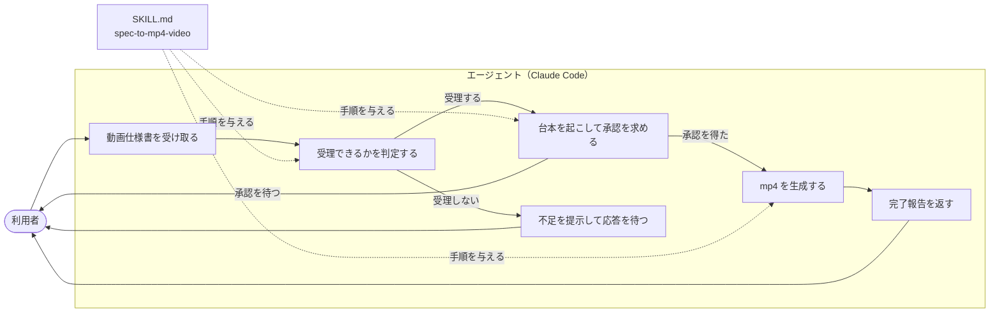
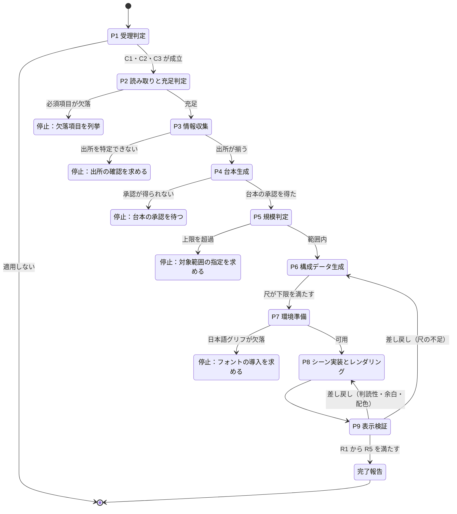
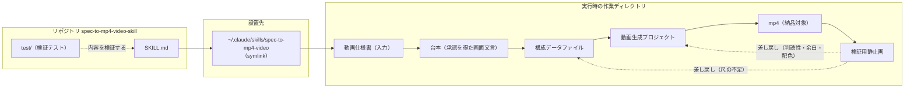

# SKILL.md の構造

リポジトリのルートにある `SKILL.md` を読み取り、その構造を図に起こしたものである。図の内容は `SKILL.md` の記載と対応する。

対象: `SKILL.md`（`name: spec-to-mp4-video`）

## ユースケース図

利用者・エージェント・スキルの関係を示す。

## 状態遷移図

`SKILL.md` の9段と、停止・差し戻しの遷移を示す。段の名称は `SKILL.md` の節見出しと一致する。

## リソース構成図

配布物・設置先・実行時の生成物の関係を示す。

リポジトリは `scripts` `references` `assets` を持たない。段階的な読み込みでは `name` と `description` が常時読み込まれ、本文は読み込みが必要になった時点で読まれる。参照ファイルを持たないため、3段目の読み込みは発生しない。
