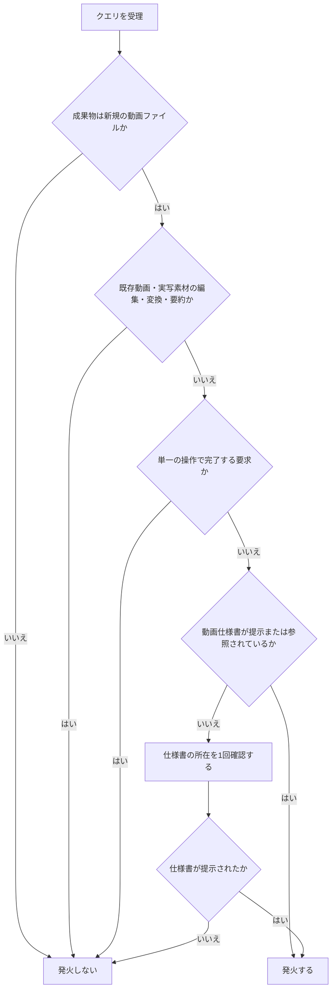
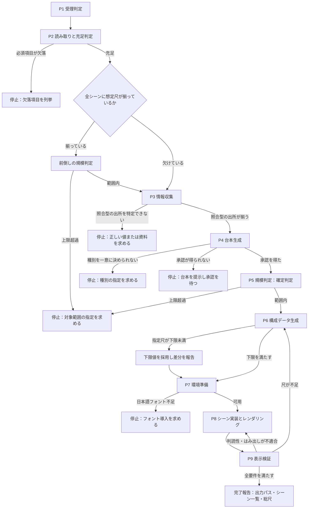
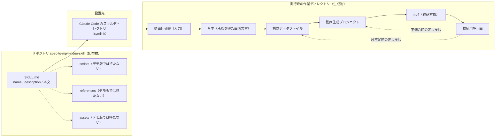

# 動画仕様書 → mp4 生成スキル 仕様書（デモ版）

## 1. 概要

本書は、動画仕様書を入力として受け取り、mp4ファイルを出力するエージェントスキルの仕様を定める。

| 項目 | 内容 |
|---|---|
| 成果物種別 | エージェントスキル（Agent Skills / SKILL.md） |
| エディション | デモ版（アイデアの視覚化） |
| 入力 | 動画仕様書（Markdownまたはプレーンテキストの文書） |
| 出力 | mp4ファイル（1920x1080 / 30fps / H.264 / 無音） |
| 構成 | SKILL.md 単体（`scripts`・`references`・`assets` を持たない） |
| 配信 | 行わない。ファイルの生成と単一ツールでの発火確認までを範囲とする |
| デザイン | なし（出力フォーマットの作り込み・テンプレート定義を行わない） |
| 測定 | なし |
| 保守 | なし |
| 監視 | なし |

デモ版であるため、機能を絞ったワンショット構成とする。エージェントが本スキルの手順に従って動画生成プロジェクトを自ら構築し、レンダリングし、表示を検証してmp4を提出するまでを一連の流れとする。

---

## 2. プラットフォーム選定

本課題のプラットフォームはエージェントスキルとする。理由は以下のとおり。

- 課題は「動画仕様書を渡すたびに、同じ手順（構成データ化・プロジェクト構築・アニメーション実装・レンダリング・表示確認）をAIエージェントに指示し直している」反復作業である。手順の受け手は人間ではなくAIエージェントであるため、電子書籍ではなくエージェントスキルに該当する。
- 手順そのものをエージェントに実行させることで課題が解決する。専用UI・データ永続化・マルチユーザー対応を必要としないため、ウェブ・デスクトップ・スマホには該当しない。
- 出力物が動画（mp4）であることは、プラットフォームの選定結果を動画に変えない。動画プラットフォームは「動画そのものが納品対象である場合」に選択するものであり、本課題の納品対象は動画を生成する手順定義である。

---

## 3. 識別子

| 項目 | 値 |
|---|---|
| リポジトリ名 | `spec-to-mp4-video-skill` |
| スキル名（`name`） | `spec-to-mp4-video` |

リポジトリを Single Source of Truth とし、ツールのスキルディレクトリへは symlink で設置する。

---

## 4. 規模

| 項目 | 値 |
|---|---|
| SKILL.md 想定行数 | 約350行（上限目安500行に対して余裕を持つ） |
| 参照ファイル数（`references`） | 0 |
| スクリプト数（`scripts`） | 0 |
| アセット数（`assets`） | 0 |

デモ版は単一ファイル構成のため、階層化・分割は行わない。行数が上限目安に近づく規模はデモ版の範囲外とする。

---

## 5. 対象ターゲットと参照した一次情報

デモ版の対象ターゲットは Claude Code の1ツールに限定する。ホスト固有のフィールド・機能（`allowed-tools`、スキル連鎖、暗黙呼び出し設定等）は使用せず、`name`・`description`・本文のコアのみで構成する。これにより、対象ターゲットを3ツールへ拡張する際に本文の書き換えを伴わない。

| 項目 | 値 |
|---|---|
| 対象ツール | Claude Code（バージョンは設置環境の `claude --version` の出力値を記録する） |
| 標準 | Agent Skills（SKILL.md、YAMLフロントマター＋Markdown本文） |
| 参照日 | 2026-08-05 |

参照した一次情報。

| 対象 | URL | 参照日 |
|---|---|---|
| Agent Skills 概要 | <https://platform.claude.com/docs/en/agents-and-tools/agent-skills/overview> | 2026-08-05 |
| 動画生成フレームワーク（Remotion）ドキュメント | <https://www.remotion.dev/docs/> | 2026-08-05 |

本領域は仕様変更が速いため、本節の値は設置時点の実測値で更新する。

---

## 6. 発火条件の設計方針

発火判定は `description` に集約し、本文には発火条件を持たせない。`description` は「何をするか（動画仕様書からmp4を生成する）」と「どの文脈で使うか（仕様書・構成表を渡して動画の書き出しを求められた場面）」の双方を含む。

発火は次の3条件の論理積で成立する。

| 記号 | 条件 |
|---|---|
| C1 | 入力として動画仕様書に相当する文書（シーンの並び・画面に出す文言・想定尺のいずれかを含む文書）が提示または参照されている |
| C2 | 期待される成果物が新規の動画ファイル（mp4）の生成である |
| C3 | 既存の動画・実写素材に対する編集・変換・要約ではない |

C2が成立しC1が不成立の場合は、発火せずに仕様書の所在を1回だけ確認する。確認への応答で仕様書が提示された時点でC1が成立し、発火する。

発火しない文脈を以下に定める。

| 文脈 | 判定 |
|---|---|
| 動画仕様書そのものの作成・添削の依頼 | 非発火（出力が文書であり、C2が不成立） |
| 既存mp4の形式変換・切り出し・結合 | 非発火（C3が不成立） |
| 既存動画の内容の要約・書き起こし | 非発火（C2・C3が不成立） |
| 動画生成フレームワークの使い方・仕様の質問 | 非発火（出力が説明であり、C2が不成立） |
| 実写素材・画面録画の編集依頼 | 非発火（C3が不成立、かつ本スキルは撮影工程を持たない） |
| 単一の操作のみで完了する要求 | 非発火（エージェントが直接処理する領域とする） |

---

## 7. 入力仕様（動画仕様書）

### 7.1 必須項目

以下を必須項目とする。いずれかが欠けている場合、既定値による補完を行わない。

| 項目 | 内容 |
|---|---|
| タイトル | 動画の題名 |
| 目的 | 視聴後に視聴者が到達している状態 |
| 想定視聴者 | 前提知識レベル |
| シーン列 | 順序付きのシーン定義（1件以上） |
| 出力先パス | 生成するmp4の配置先 |

シーン定義は次の項目を持つ。

| 項目 | 内容 |
|---|---|
| 見出し | シーンの主題 |
| 主張 | そのシーンで視聴者に伝える内容 |
| 想定尺 | 秒数 |

画面に表示する文言そのものと、画面表現の種別（タイトル／箇条書き／端末／コード／図解／まとめ）は必須項目としない。どちらも設計の産物ではなく制作の産物であり、設計レベルの文書には含まれないことがあるためである。文言と種別は第9節P4の台本生成で確定する。種別は仕様書の画面要素の記述を根拠として決定し、一意に決められない場合は停止する。仕様書に画面表示テキストまたは種別が記載されている場合は、P4でそれをそのまま採用する。

### 7.2 任意項目

配色トーン、フォント指定、シーン間の遷移種別、コマンド出力の要点を任意項目とする。指定がない場合は既定値を採用し、採用した既定値を完了報告に列挙する。

### 7.3 不足時の扱い

必須項目の欠落を検出した場合、処理を停止し、欠落項目を列挙して提示する。事実・尺・シーン構成をスキル側で創作しない。ここでいう事実とは、視聴者が入力するコマンド文字列、対象が出力する文言、バージョン番号のように、出所を特定できる情報源によって裏付けられるものを指す。画面に表示する文言そのものは事実に含めず、第9節P4の台本生成でシーンの主張にもとづいて起こす。想定尺のみが欠けている場合は第9.3節の尺下限式による算出値を提示し、承認を得たうえで再開する。

---

## 8. 出力仕様

### 8.1 主成果物

| 項目 | 値 |
|---|---|
| 形式 | mp4（H.264） |
| 解像度 | 1920x1080 |
| フレームレート | 30fps |
| 音声 | なし（デモ版はナレーション・BGMを持たない） |
| 配置 | 仕様書が指定する出力先パス |

出力先に同名ファイルが存在する場合は上書きせず、連番を付与した別名で出力し、既存ファイルの所在を完了報告に含める。

### 8.2 副次生成物

作業ディレクトリに次を残す。これらは中間物であり、納品対象は主成果物のみとする。

| 生成物 | 役割 |
|---|---|
| 構成データファイル | 承認された台本を正規化したシーン定義。画面文言の唯一の保持先 |
| 動画生成プロジェクト | 構成データを読み込んで描画する実装一式 |
| 検証用静止画 | 表示確認に用いる抽出フレーム |

### 8.3 完了報告

出力パス、シーン一覧と各シーンの尺、総尺、採用した既定値、第10節の要件に対する充足状況を報告する。

---

## 9. 手順の論理構造と分岐条件

手順を9段で構成する。各段は完了条件を持ち、完了条件を満たさない状態で次段へ進まない。

| 段 | 名称 | 処理 | 完了条件 |
|---|---|---|---|
| P1 | 受理判定 | 第6節の条件で発火可否を判定する | C1・C2・C3が成立している |
| P2 | 読み取りと充足判定 | 仕様書を読み、必須項目の充足を判定する。全シーンに想定尺が揃っている場合は前倒しの規模判定を行う | 必須項目がすべて揃い、前倒しの規模判定を行った場合は範囲内である |
| P3 | 情報収集 | 逐語一致を要する文字列を照合型と起案型に分け、照合型を出所を特定できる情報源から集める | 照合型の文字列すべてに出所が紐づき、起案型が起案として記録されている |
| P4 | 台本生成 | シーンの主張から画面に表示する文言を起こし、画面要素の記述から種別を決め、承認を得る | 全シーンの画面表示テキストと種別が確定し、承認を得ている |
| P5 | 規模判定 | 確定した台本にもとづき、シーン数・総尺がデモ版の範囲内かを判定する（確定判定） | 範囲内である |
| P6 | 構成データ生成 | 承認された台本を正規化し、シーン定義を構成データファイルへ書き出す | 台本の文言が原文のまま保持され、各シーンの尺が下限式を満たす |
| P7 | 環境準備 | 動画生成プロジェクトを構築し、日本語フォントの可用性を判定する | プロジェクトが起動し、日本語グリフが欠落しない |
| P8 | シーン実装とレンダリング | 構成データを描画するシーンを実装し、CLIでレンダリングする | mp4が出力仕様どおりに生成されている |
| P9 | 表示検証 | 第10節の要件を満たすかを判定する | 全要件を満たす |

P3とP4は、画面に表示する文言が確定していない設計レベルの仕様書を受けたときに実質的な処理を行う。文言が確定している仕様書では、収集の対象と生成の対象がいずれも存在しないことを確認して通過する。

### 9.1 分岐条件

| 判定点 | 条件 | 遷移 |
|---|---|---|
| P1 | 発火条件が不成立 | 発火しない |
| P1 | C2成立・C1不成立 | 仕様書の所在を1回確認し、提示されればP2へ進む |
| P2 | 必須項目が欠落 | 停止し、欠落項目を列挙する |
| P2 | 全シーンに想定尺が揃っており、前倒しの規模判定で上限を超過 | 停止し、対象範囲の指定を求める。絞った対象のみをP3・P4で扱う |
| P2 | 想定尺が欠けているシーンがある | 前倒しの規模判定を行わず、P5の確定判定に委ねる |
| P3 | 照合型の文字列の出所を特定できない | 停止し、対象を列挙して正しい値または資料を求める |
| P3 | 起案型（依頼文）である | 出所の特定を求めず、起案として P4 の承認に含める |
| P4 | 画面要素の記述から種別を一意に決められない | 停止し、対象シーンを列挙して種別の指定を求める |
| P4 | 台本の承認を得ていない | 停止し、台本を提示して承認を待つ。承認前に後続段の副作用を起こさない |
| P5 | 範囲超過 | 停止し、対象範囲の指定を求める |
| P5 | 仕様書が優先度・スキップ可否を明示している | 明示された記述を根拠に対象シーンを決め、根拠とともに提示する |
| P6 | 指定尺が下限を下回る | 下限値を採用し、差分を報告する |
| P7 | 日本語フォントが不足 | 停止し、必要なフォントの導入を求める |
| P9 | 判読性・はみ出しの不適合 | P8へ差し戻す |
| P9 | 尺の不足 | P6へ差し戻す |

### 9.2 デモ版の規模上限

| 項目 | 上限 |
|---|---|
| シーン数 | 8 |
| 総尺 | 120秒 |

上限を超える仕様書は、先頭からの部分生成を行わず、対象範囲の明示的な指定を待つ。ただし仕様書がシーンの優先度・スキップ可否を明示している場合は、その記述を根拠として対象シーンを決めてよい。根拠として用いてよいのは仕様書の記述に限り、根拠を持たない間引きは行わない。

上限の判定は2回行う。判定材料が2通りあり、前者では台本を待つ理由が無いためである。

| 判定 | 実施する段 | 条件 | 判定材料 |
|---|---|---|---|
| 前倒し判定 | P2 | 全シーンに想定尺が揃っている | 想定尺の合計 |
| 確定判定 | P5 | つねに行う | 尺の下限式を適用した後の値 |

前倒し判定で対象シーンを絞った場合、P3・P4は対象シーンのみを扱う。想定尺が欠けているシーンがある場合は前倒し判定を行わない。前倒し判定を通過しても確定判定を省略しない。下限式によって尺が伸び、上限を超えることがあるためである。

### 9.3 尺の下限式

各シーンの尺の下限は、画面表示テキストの総文字数を毎秒6文字で除した値に、表示前後の余白2秒を加えた値とする。総文字数は第9節P4で確定した台本の文言から数える。仕様書の指定尺がこの下限を下回る場合、下限値を採用する。

---

## 10. 設計要件

### 10.1 表現の要件

- 実写・画面録画・写真素材を用いず、画面表現は2Dの描画で構成する。撮影工程を持たない。
- 端末画面は黒背景・等幅フォント・カーソル表現で表し、実物の忠実な再現を目的としない。配色・枠線・タブ等は読みやすさを優先して設計する。
- 正確さを要求する対象は、視聴者が入力するコマンド文字列と、対象が出力する文言の要点に限る。
- 画面文言は構成データファイルにのみ保持し、シーンの実装コードへ文字列を直接埋め込まない。文言の修正がデータ編集のみで完結する構造とする。
- 承認された台本の画面文言を要約・言い換え・翻訳しない。仕様書に画面文言が記載されている場合は、原文をそのまま台本へ採用する。

### 10.2 アニメーション実装の要件

- すべての時間変化する値を、現在フレーム番号を引数とする純粋関数として実装する。CSSのトランジション、ユーティリティクラスによるアニメーション、タイマーによる遅延実行は、レンダリング時に反映されないため用いない。
- シーン間の遷移は遷移用の連結構造を用い、各シーンの開始フレームの手計算を行わない。
- 装飾のみを目的とした動きを追加しない。

### 10.3 可読性の要件

- 本文の文字サイズは縦解像度の3%以上とし、1920x1080において32px以上とする。
- すべての文字と図形を、上下左右5%の安全余白の内側に収める。
- 2倍速再生においても文字が判読できる大きさとする。
- グレースケール表示に変換しても意味が失われない配色とする。色のみで区別する表現を持たない。
- 音声を再生できない環境での視聴を前提とし、画面のみで内容が成立する構成とする。

### 10.4 検証の要件

レンダリング後、各シーンの先頭・中間・末尾のフレームを静止画として抽出し、10.3の各項目への適合を判定する。不適合の項目は、第9.1節の遷移に従って該当段へ差し戻す。

### 10.5 範囲外

デモ版では次を範囲外とする。

- ナレーション生成・字幕ファイルの出力
- 3D表現および外部レンダラによる素材書き出し
- BGM・効果音の付与
- サムネイル画像の生成
- 公開プラットフォームへのアップロード

---

## 11. 制約の適用範囲

| 制約領域 | 適用 |
|---|---|
| サーバ・DB・セッション・認証 | 非適用（存在しないため） |
| 外部APIの利用制限 | 非適用（公開エンドポイントを持たず、実行者自身の環境で実行者自身の資格情報により動作するため） |
| ハードウェア連携 | 対象外 |
| 個人情報の取り扱い方針 | 非適用（利用者の情報はエージェントの実行環境で完結し、取得しないため） |
| 著作権・第三者の権利 | 適用 |

---

## 12. セキュリティ・権利の要件

- 資格情報をSKILL.md本文に記載しない。必要な場合は環境変数として外部化し、変数名のみを記述する。デモ版の構成では資格情報を必要としない。
- SKILL.md本文に、実在の個人を特定できる情報（メールアドレス・アカウント名・パス等）を記載しない。
- 生成される画面表現の中にも、実在の個人を特定できる情報を表示しない。仕様書に含まれる場合は伏せ字化の可否を確認する。
- 第三者の著作物は、主従関係・出典明示・改変禁止の要件を満たす範囲でのみ用いる。フォントは商用利用可のライセンスであることを確認して用いる。

---

## 13. 発火判定の決定木

---

## 14. 手順フロー図

---

## 15. リソース構成図

破線で示す `scripts`・`references`・`assets` はデモ版の構成に含まれない。段階的な読み込みの観点では、`name` と `description` が常時読み込まれ、本文は発火時に読み込まれる。デモ版は参照ファイルを持たないため、3段目の読み込みは発生しない。

---

## 16. 仕様書と成果物の境界

本書は仕様であり、配布物であるSKILL.md本文と同一ではない。両者の境界を以下に定める。

| 本書に記載する | 本書に記載しない（成果物側の内容） |
|---|---|
| 発火条件の設計方針と成立条件（第6節） | `description` の実文 |
| 手順の論理構造と分岐条件（第9節） | エージェント宛ての命令文 |
| 構成の分割方針（第4節・第15節） | スクリプトの実装 |
| 入力・出力フォーマットの定義（第7節・第8節） | YAMLフロントマターの実値 |
